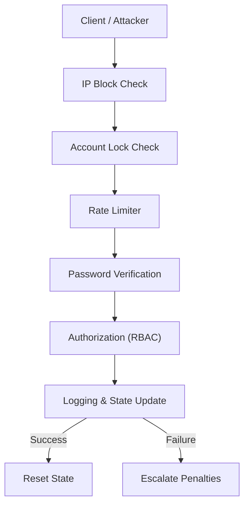

# SecureAuth Monitor 🔐

SecureAuth Monitor is a Python-based authentication security system
that defends against brute-force attacks, credential abuse, and
automated login threats using a layered, defense-in-depth approach.

It simulates how real-world systems monitor authentication behavior,
detect abuse patterns, and apply escalating protections.

---

## 🧠 Problem

Authentication endpoints are among the most targeted components of
modern applications. Attackers commonly use brute-force attempts,
credential stuffing, and IP rotation to bypass weak defenses.

Single-layer protections are insufficient against these threats.

---

## 🛡️ Solution

SecureAuth Monitor combines multiple defensive controls to protect
authentication systems while remaining fair to legitimate users.

The system tracks login behavior, applies rate limits, escalates
penalties for abusive sources, and resets state after successful
authentication.

---

## 🚀 Key Features
- Sliding-window rate limiting per IP
- Temporary and permanent IP blocking with escalation
- Account-level lockout independent of IP
- Progressive delay on repeated failures
- Secure password verification using bcrypt
- Automatic state reset after successful login
- Detailed logging of authentication events

---

## 🔁 Authentication Flow

1. Login request received
2. Permanent and temporary IP block checks
3. Account-level lock check
4. Sliding-window rate limit evaluation
5. Password verification (bcrypt)
6. Authorization check (RBAC)
7. State reset or escalation based on outcome
8. Event logging

--- 

## 🎯 Why This Project Exists

Most authentication demos stop at password checks.
Real-world systems fail because attackers exploit **rate limits, IP rotation,
credential stuffing, and weak escalation logic**.

This project was built to simulate **how production-grade authentication systems
actually defend themselves**, using layered controls, progressive penalties,
and clear observability — not just happy-path logins.

---

### 🧩 Control-to-Threat Mapping

| Security Control        | Threat Mitigated                         |
|-------------------------|------------------------------------------|
| Rate Limiting           | Brute-force & automated abuse            |
| IP Blocking             | IP rotation & repeated malicious traffic |
| Account Lockout         | Credential stuffing                      |
| Progressive Delays      | High-speed password guessing             |
| RBAC Authorization      | Privilege escalation                     |
| Event Logging           | Post-incident analysis & forensics       |

---

### 🔐 Security Controls Mapping

| Threat                     | Control Applied                     | Location |
|----------------------------|-------------------------------------|----------|
| Brute-force attacks        | Rate limiting, progressive delay    | auth_monitor.py |
| Credential stuffing        | Account lockout, IP blocking        | auth_monitor.py |
| IP rotation abuse          | Sliding window + escalation         | auth_monitor.py |
| Privilege misuse           | RBAC authorization checks           | auth_monitor.py |
| Detection & forensics      | Structured event logging            | auth_monitor.py |

---

## 🧱 Architecture & Attack Flow

The system is designed with layered security checks to handle both
legitimate users and hostile traffic fairly.

**Request lifecycle:**

1. Incoming request is checked against permanent IP bans
2. Temporary IP blocks are evaluated
3. Account lock status is verified
4. Sliding-window rate limiting is applied per IP
5. Password verification using bcrypt
6. Authorization check (RBAC)
7. Security state is reset on success or escalated on failure
8. All events are logged for audit and analysis

This layered approach prevents single-point failures and makes common
attack techniques such as brute-force, IP rotation, and credential
stuffing ineffective.

 ---

 ## Documentation
- [Threat Model](docs/THREAT_MODEL.md)

---

### 🔄 Authentication Flow (High-Level)

---

### 🎯 Explicit Threat Coverage

This project explicitly models and mitigates:

- Brute-force password guessing
- Credential stuffing attacks
- IP rotation to bypass rate limits
- Account enumeration attempts
- Abuse via automated scripts

Each control is designed to fail safely and escalate progressively.

---

### 🔐 Security Controls Mapping

| Threat                     | Control Applied                     | Location |
|----------------------------|-------------------------------------|----------|
| Brute-force attacks        | Rate limiting, progressive delay    | auth_monitor.py |
| Credential stuffing        | Account lockout, IP blocking        | auth_monitor.py |
| IP rotation abuse          | Sliding window + escalation         | auth_monitor.py |
| Privilege misuse           | RBAC authorization checks           | auth_monitor.py |
| Detection & forensics      | Structured event logging            | auth_monitor.py |

---

## 🔐 Security Design Principles

This project follows core security engineering principles:

- **Defense in Depth** – Multiple layered controls instead of a single point of failure
- **Fail Securely** – Failed authentication increases restrictions, never access
- **Least Privilege** – Authorization enforced after authentication (RBAC)
- **Rate Limiting & Abuse Resistance** – Prevents brute-force and automated attacks
- **Observability** – All attempts are logged for detection and analysis

---

## 🛠️ Tech Stack
- Python 3
- bcrypt for secure password hashing
- Time-based sliding window algorithms
- Defensive security logic
- Git & GitHub

---

## 🎯 Why This Project Matters

This project reflects how production systems in SaaS platforms,
financial services, and enterprise applications approach
authentication security.

It emphasizes **resilience, layered defenses, and user fairness**
rather than relying on a single blocking mechanism.

---
## Design Philosophy
This project follows a defense-in-depth approach.
Each authentication layer is designed to fail safely,
limit attacker progress, and protect legitimate users
without relying on a single control.

---

## Limitations
- This is a simulated authentication system, not production-ready
- No MFA or CAPTCHA implemented
- Uses in-memory state instead of persistent storage

---

### ⚠️ Assumptions & Non-Goals

- This project focuses on authentication abuse mitigation, not identity verification
- Network-level protections (WAF, firewall rules) are assumed external
- CAPTCHA/MFA are intentionally excluded to highlight backend controls
- Designed for educational and architectural demonstration purposes

---

## 📌 Future Improvements
- External persistent storage (Redis / database)
- REST API integration
- Alerting via email or webhooks
- Distributed rate limiting
- Visualization dashboard
